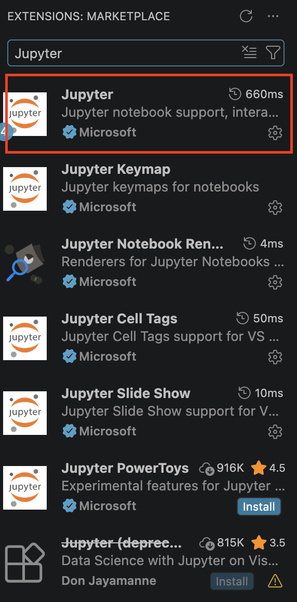
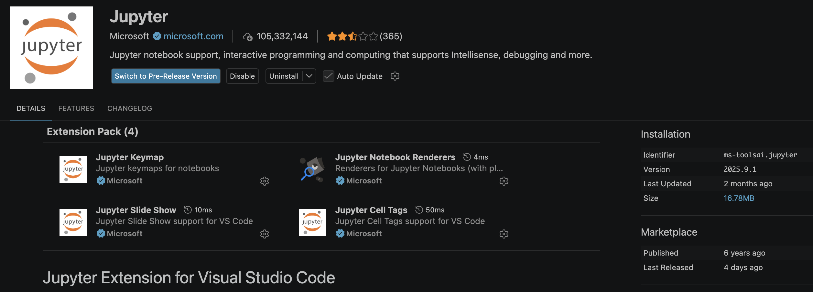
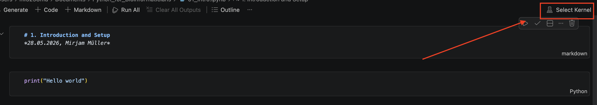
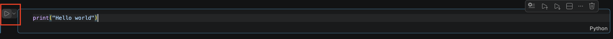
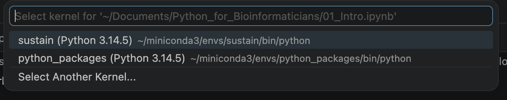
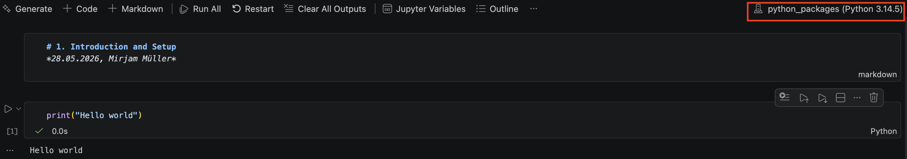

# How to use a Jupyter Notebook

Jupyter notebooks are convenient because they allow you to mix explanation blocks and code blocks. But unlike a pdf or a textbook, you cannot just look at the code but also immediately run it :)

There are several ways to use them, including an online option. But here I will show you how to install the jupyter extension for VSCode and run a jupyter notebook file. Note, that for this to work, you need a working installation of python. If you do not have one, I recommend getting [miniconda](https://www.anaconda.com/docs/getting-started/miniconda/install/overview). It includes python and can also be used for package installations and other bioinformatic tools, but I digress. This is a python "tutorial" not conda.

So, once you have your VSCode open, you go to the Extension option in the VSCode sidebar:

Once you click there, a sidepanel will open where you can type Jupyter. 

You click the top result and press install on the opening page. When installed it will look like this:

Now you can open the first jupyter notebook! You will now also get the option to choose "Jupyter notebook" when you create a new file.

When opening a jupyter notebook and running a cell, VSCode will ask you to select a python kernel. Its basically asking you which python installation you would like to use to run this notebook on. If you are familiar with conda (mentioning it again, sorry) it can be good to create an environment with specific python installation and packages for a particular project. If you follow this tutorial all the way to the end, you will have to install packages at some point (such as pandas). This is how you select the kernel:

You can either click on the top right of your jupyter notebook

Or you can click the play button to the left of a code cell

You will then be prompted by the dropdown menu, to select a kernel

Once you pick an option, VSCode will then connect to the kernel. You can see the status of that in the bottom right corner.

When it is done connecting, you can see your current kernel on the top right corner.

And that is it! You are ready to start using Jupyter notebooks! :)
